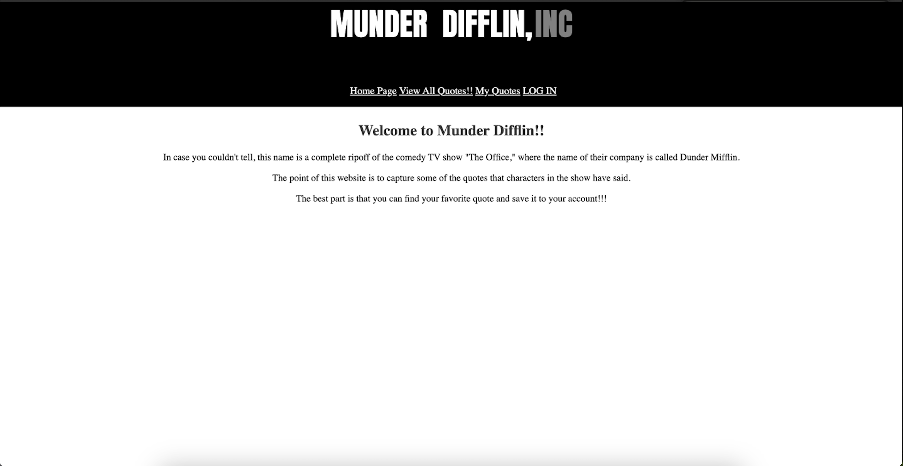
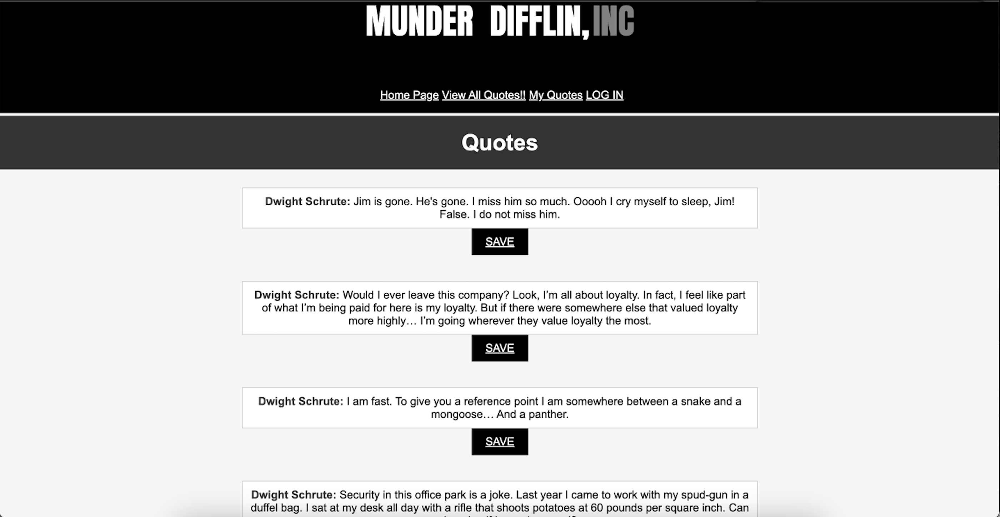

# Munder Difflin

Munder Difflin is a web application that lets you discover and save your favorite quotes. Inspired by the hit TV show "The Office," this website provides a platform for users to browse memorable quotes from the show and save them to their personal accounts.

## Features

- **Quote Collection**: Browse a vast collection of quotes from "The Office" TV show.

- **User Accounts**: Create an account to save your favorite quotes for future reference.

- **User-Friendly Interface**: The website offers an easy-to-navigate, user-friendly design.

## Getting Started

All you have to do to play the game is to [CLICK HERE](https://munder-difflin-1c754b52c7e7.herokuapp.com/)

## Screenshots

## Usage

1. Create an account or log in if you already have one.

2. Browse the collection of quotes from "The Office."

3. Click on a quote to save it to your account.

4. View your saved quotes in your profile.

## Contributing

If you'd like to contribute to this project, please follow these steps:

1. Fork the repository.
2. Create a new branch for your feature (`git checkout -b feature-name`).
3. Commit your changes (`git commit -m 'Add feature'`).
4. Push to the branch (`git push origin feature-name`).
5. Open a Pull Request.

## Contact

If you have any questions or suggestions, feel free to contact me at [11benmo33@gmail.com].

---

Happy quoting!